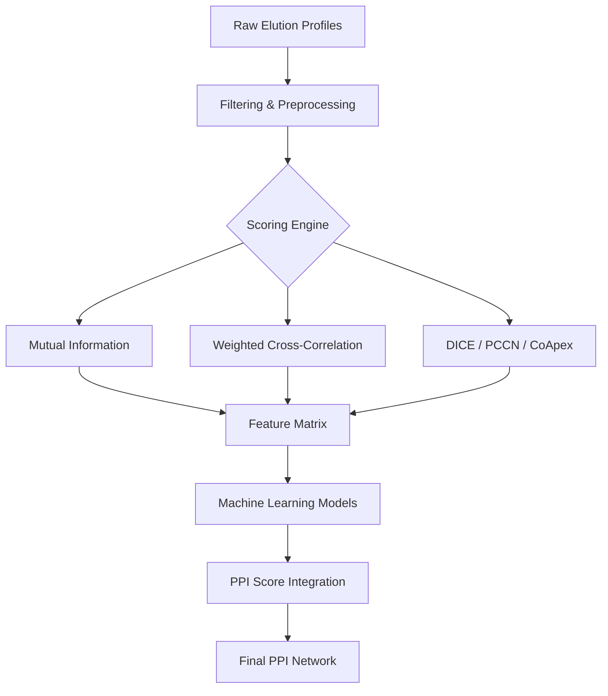

# SMED: Statistical Modelling of co-elution Mass Spectrometry Data

<div align="center">
  
  
  
</div>

---

SMED is a high-performance R package designed for assigning probability scores to protein-protein interactions (PPIs) inferred from biochemical fractionation mass spectrometry (BF-MS) experiments. It leverages advanced scoring metrics and machine learning integration to provide robust PPI networks.

## Why SMED?

Co-elution mass spectrometry produces complex multidimensional data. SMED simplifies the inference process by:
-   **Multi-Metric Scoring**: Using a combination of statistical and information-theoretic metrics.
-   **Machine Learning Integration**: Employing ensemble models (XGBoost/Random Forest) to unify different co-elution features.
-   **Parallel Processing**: Leveraging the `future` framework for fast execution on large datasets.

## Workflow



## Installation

Install the latest version from GitHub:

```r
# Install devtools if not already present
if (!require("devtools")) install.packages("devtools")

# Install SMED
devtools::install_github("zqzneptune/SMED")
```

## Quick Start

```r
library(SMED)

# 1. Load built-in dummy data
data(dummy_elution_matrix)
data(dummy_train_complexes)

# 2. Run the full SMED pipeline
# This calculates scores and integrates them via XGBoost by default
results <- SMED(
  mRaw = dummy_elution_matrix, 
  trainInt = dummy_train_complexes,
  fnMachine = "xgbTree"
)

# 3. View the top predicted interactions
head(results[order(-Score)])
```

## Example Data

The package includes standardized co-elution data from **Havugimana et al. (2012)**. You can find these files in the `inst/exdata/Havugimana_etal_2012/` directory.

### Key Datasets:
-   **LTQ & Orbitrap**: Data from different mass spectrometry platforms.
-   **HeLa & 293NE**: Elution profiles from diverse cell lines and fractions (Nuclear vs. Cytoplasmic).
-   **RefComplexes.txt**: A curated set of reference protein complexes for training and validation.

For more details on specific files, see [`exdata_info.txt`](inst/exdata/Havugimana_etal_2012/exdata_info.txt).

## Documentation

For detailed function documentation, use the standard R help system:
```r
?SMED
?ElutionScore
?MachineLearning
```

## License

This project is licensed under the MIT License - see the [LICENSE](LICENSE) file for details.
